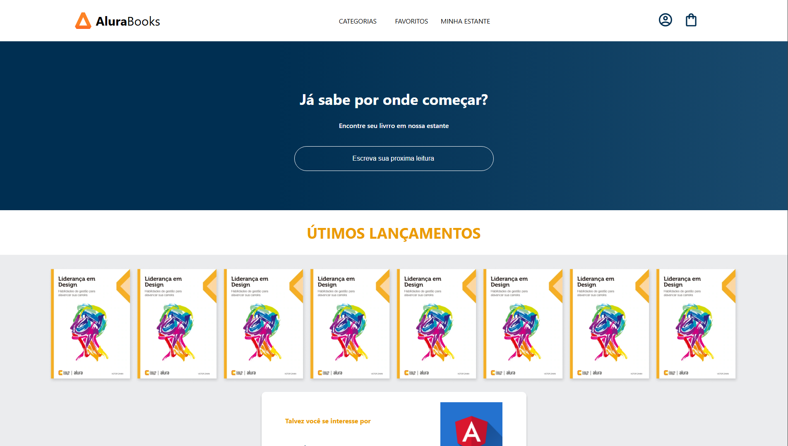

# Alura Books - Projeto de Estudo em React

## Sobre o Projeto 📖

Este projeto foi desenvolvido durante o curso **"React: comece seu projeto full stack"** da [Alura](https://cursos.alura.com.br/course/react-crie-primeira-pagina-web). O objetivo foi criar uma **landing page** simples para o site **Alura Books**, aplicando os conceitos básicos do React.

## 📸 Preview do Projeto



## Objetivos do Curso 🎯

- Compreender os conhecimentos básicos teóricos e práticos de **React**.
- Aplicar técnicas de manutenção em uma aplicação React.
- Desenvolver um website próprio utilizando **React**.
- Colocar em prática ferramentas amplamente utilizadas no mercado de front-end.

## Conceitos Aprendidos 🛠️

- **Criação do primeiro componente** em React.
- Uso de **styled-components** para estilização.
- Manipulação de **estados** e **props**.
- Estruturação e **finalização** do projeto.

## Funcionalidades do Projeto 🚀

- **Landing page** estática sem rotas.
- Seção "**Já sabe por onde começar?**" com um campo para inserir o nome do livro.
- Lista de **últimos lançamentos** com todos os livros mais recentes.
- Seção "**Talvez você se interesse por...**" com sugestões de livros.

## Tecnologias Utilizadas ⚛️

- [React](https://reactjs.org/)
- [Styled-components](https://styled-components.com/)

## Como Executar o Projeto 💻

1. **Clone o repositório:**
   ```bash
   git clone https://github.com/seu-usuario/alura-books.git
   ```

2. **Instale as dependências:**
   ```bash
   npm install
   ```

3. **Inicie o projeto:**
   ```bash
   npm start
   ```

4. **Acesse no navegador:**
   ```
   http://localhost:3000
   ```

## Próximos Passos 🏆

- Adicionar rotas para diferentes páginas.
- Melhorar a responsividade.
- Implementar filtros para os livros.
- Adicionar integração com uma API para carregar os livros dinamicamente.

---

Feito com 💙 durante o curso da Alura!

